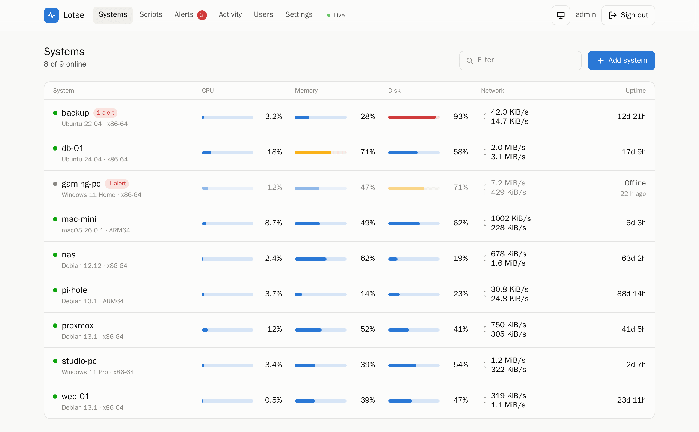
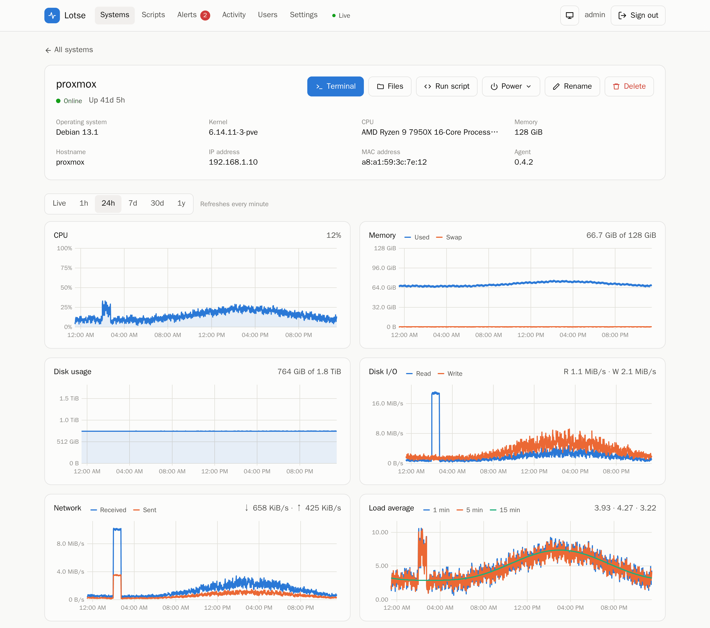
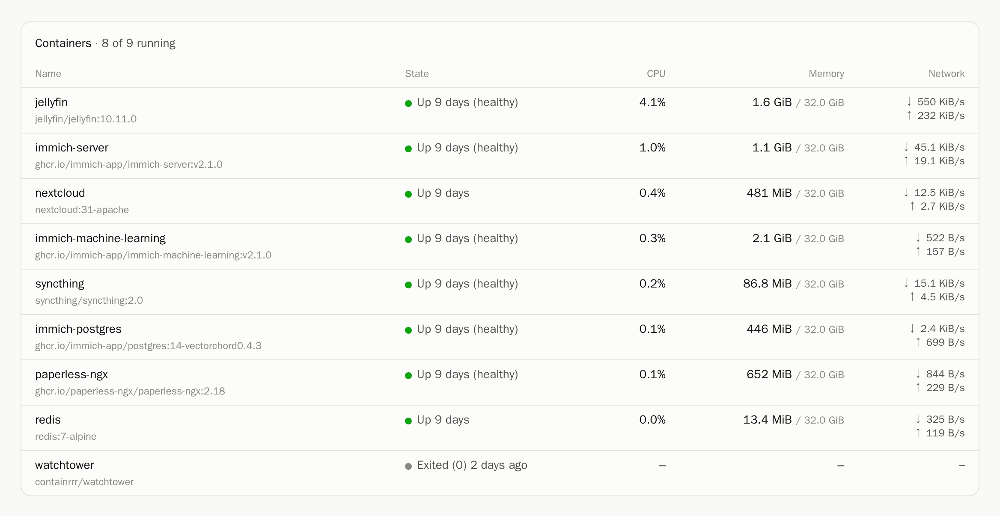
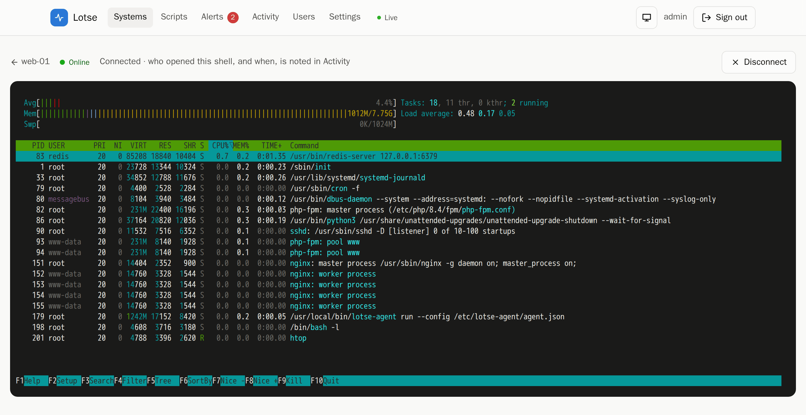
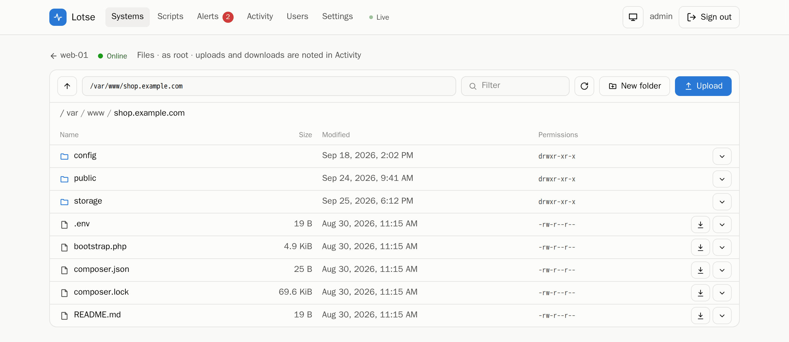
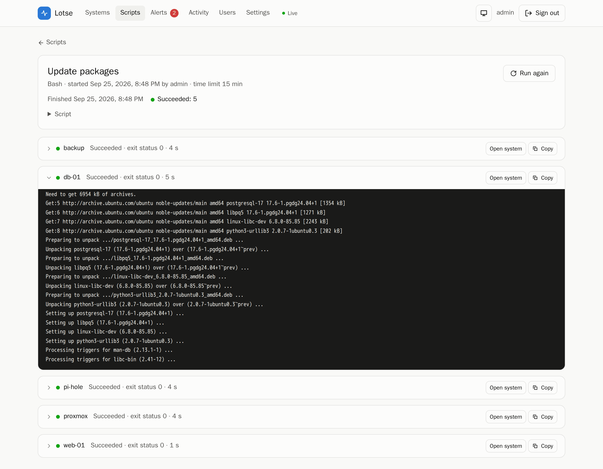
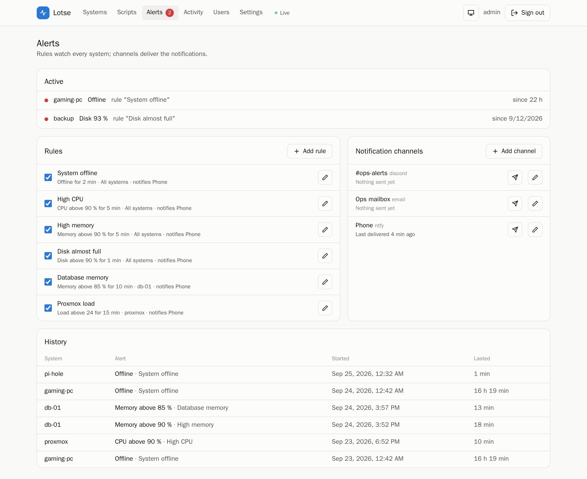
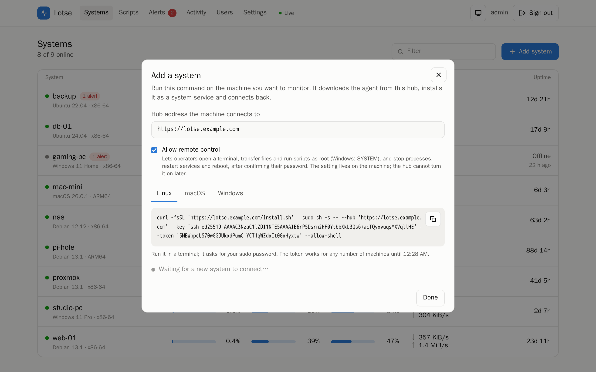

<p align="center">
  
</p>

<h1 align="center">Lotse</h1>

<p align="center">
  <strong>Self-hosted monitoring and remote control for Linux, macOS and Windows machines.</strong><br>
  A tiny hub in Docker and a small agent on each machine. Watch them, get alerted, and fix things from your browser.
</p>

<p align="center">
  <a href="https://github.com/Jackolix/Lotse/actions/workflows/build.yml"></a>
  <a href="https://github.com/Jackolix/Lotse/releases/latest"></a>
  <a href="https://github.com/Jackolix/Lotse/pkgs/container/lotse"></a>
  
  <a href="go.mod"></a>
</p>

<p align="center">
  <a href="#quick-start">Quick start</a> ·
  <a href="#a-quick-tour">Tour</a> ·
  <a href="#adding-machines">Adding machines</a> ·
  <a href="#security-model">Security</a> ·
  <a href="https://github.com/Jackolix/Lotse/releases">Releases</a>
</p>

<picture>
  <source media="(prefers-color-scheme: dark)" srcset="docs/screenshots/overview-dark.png">
  
</picture>

**Lotse** (German for a ship's pilot) is a lightweight monitoring hub in the spirit of
[Beszel](https://github.com/henrygd/beszel) that can also act on your machines. Besides charts and alerts, it gives
you a browser terminal, file transfer, scripts across many machines, service and process control, reboots and
Wake-on-LAN, with several users, roles, passkeys, an audit log and signed agent self-updates.

<table>
<tr>
<td width="50%" valign="top">

**Watch**

- CPU, memory, swap, disk, disk I/O, network and load, live and for up to a year
- Docker and Podman containers, top processes, systemd, launchd and Windows services
- Alerts to ntfy, Discord, Slack, Telegram, email or any webhook

</td>
<td width="50%" valign="top">

**Act** (opt-in per machine)

- A real terminal in the browser: bash or zsh, PowerShell on Windows
- Browse, upload and download files over SFTP
- Run saved scripts on many machines at once, with live output
- Restart services, stop processes, reboot, shut down, Wake-on-LAN

</td>
</tr>
<tr>
<td width="50%" valign="top">

**Stay in control**

- Viewer, operator and administrator roles, two-factor login and passkeys
- Sensitive actions ask for your password again and land in the activity log
- Agents pin the hub's key and install only signed updates

</td>
<td width="50%" valign="top">

**Stay small**

- Hub: one Go binary with the web UI and SQLite built in, idles under 10 MB RAM
- Agent: one static ~8 MB binary, idles at ~15 MB RAM and ~0 % CPU
- Agents dial out, so machines need no open ports and can sit behind NAT

</td>
</tr>
</table>

## Quick start

Start the hub on any machine with Docker:

```sh
docker run -d --name lotse-hub --restart unless-stopped \
  -p 8090:8090 -v lotse-data:/data ghcr.io/jackolix/lotse:latest
```

Or with Compose, using the [`docker-compose.yml`](docker-compose.yml) from this repository (it also works in CasaOS,
ZimaOS and Portainer):

```sh
curl -fLO https://raw.githubusercontent.com/Jackolix/Lotse/main/docker-compose.yml
docker compose up -d
```

1. Open `http://<docker-host>:8090` and create the admin account.
2. Click **Add system**, pick Linux, macOS or Windows, and run the command it shows on that machine.
3. The machine appears within seconds.

To reach the hub from outside your network, put it behind HTTPS; see
[Behind a reverse proxy or Cloudflare Tunnel](#behind-a-reverse-proxy-or-cloudflare-tunnel).

## A quick tour

<sub>The screenshots show a demo hub with sample machines. They follow your GitHub theme (light or dark).</sub>

### Every chart for every machine

Live, 1 hour, 24 hours, 7 days, 30 days or a year. Filesystems, services and processes sit below the charts.

<picture>
  <source media="(prefers-color-scheme: dark)" srcset="docs/screenshots/system-dark.png">
  
</picture>

### Containers without setup

If Docker or Podman runs on the machine, every container shows up with its state, CPU, memory and network. The agent
reads the local API socket; there is nothing to configure.

<picture>
  <source media="(prefers-color-scheme: dark)" srcset="docs/screenshots/containers-dark.png">
  
</picture>

### A terminal in the browser

A full terminal on the machine, carried over the agent's encrypted link. Opening one asks for your password again,
and who opened which shell, and when, is recorded under **Activity**.

<picture>
  <source media="(prefers-color-scheme: dark)" srcset="docs/screenshots/terminal-dark.png">
  
</picture>

### Files

Browse, upload (drag and drop works), download, rename and delete. Transfers stream through the hub over SFTP; the
hub keeps no copy.

<picture>
  <source media="(prefers-color-scheme: dark)" srcset="docs/screenshots/files-dark.png">
  
</picture>

### One script, many machines

Save the commands you run often, then run them on any number of machines at once. Output streams in live, and each
machine's result is kept for 90 days.

<picture>
  <source media="(prefers-color-scheme: dark)" srcset="docs/screenshots/run-dark.png">
  
</picture>

### Alerts and notifications

Rules for offline machines, CPU, memory, disk and load, for all machines or just one. Notifications go out when an
alert fires and when it resolves.

<picture>
  <source media="(prefers-color-scheme: dark)" srcset="docs/screenshots/alerts-dark.png">
  
</picture>

### Adding a machine

One command per OS. Remote control stays off unless you tick the box, and the choice is stored on the machine
itself, so the hub cannot turn it on later.

<picture>
  <source media="(prefers-color-scheme: dark)" srcset="docs/screenshots/add-dark.png">
  
</picture>

## Running the hub

```sh
docker compose pull && docker compose up -d      # release image from ghcr.io/jackolix/lotse
make docker && docker compose up -d              # or build the image from source first
```

The compose file works as is in app managers like CasaOS, ZimaOS or Portainer. `/data` can be a named volume or a
bind-mounted folder.

Open `http://<docker-host>:8090`. On first visit you create the admin account. More accounts can be added under
**Users** (see [Users and roles](#users-and-roles)).

| Variable        | Default        | Meaning                                                                   |
| --------------- | -------------- | ------------------------------------------------------------------------- |
| `HUB_URL`       | _(from browser)_ | Address agents use to reach the hub, e.g. `http://hub.lan:8090`          |
| `HUB_ADDR`      | `:8090`        | Listen address                                                            |
| `HUB_DATA_DIR`  | `/data`        | Database and hub key (`hub_ed25519`); **back this up**                    |
| `HUB_AGENT_DIR` | `/app/agents`  | Agent binaries served for installation                                    |
| `PUID`, `PGID`  | `65532`        | User the hub switches to after taking ownership of `/data`               |
| `HUB_TRUSTED_PROXIES` | _(none)_ | Reverse proxies whose `X-Forwarded-For` names the client, e.g. `192.168.1.20` or `172.18.0.0/16` |

The hub key in `/data/hub_ed25519` is the identity every agent pins. If you lose it, all agents must be
reinstalled.

### Behind a reverse proxy or Cloudflare Tunnel

The hub speaks plain HTTP, so a proxy in front (Caddy, Traefik, Nginx Proxy Manager, cloudflared) provides HTTPS.

- Set `HUB_TRUSTED_PROXIES` to the proxy's address, as the hub sees it. Otherwise every client seems to come from the
  proxy: a stranger's failed logins lock out everyone using that route, and the activity log shows only the proxy.
  To find the address, sign in through the proxy before setting it and look under **Activity**. A proxy on another
  machine shows up with its LAN IP. A proxy on the Docker host itself (e.g. cloudflared pointed at
  `localhost:8090`) shows up as the gateway of the hub's Docker network:
  `docker inspect lotse-hub --format '{{range .NetworkSettings.Networks}}{{.Gateway}}{{end}}'`. With
  `network_mode: host`, it is `127.0.0.1,::1`.
- Set `HUB_URL=https://…` so notifications link to the public address and **Add system** suggests it.
- The proxy must keep the original `Host` header (the default for all of the above). Sign-in, passkeys and terminals
  check the browser's origin against it.
- Passkeys belong to the hostname they were created on, and browsers only offer them over HTTPS. Add them through
  the public address.
- If the web UI is reachable from the internet, it can open root shells on every machine installed with
  `--allow-shell`. Turn on two-factor login or passkeys. Better still, put an access gate in front (Cloudflare Access,
  Authelia, …). Leave `/api/agent/connect`, `/install.sh`, `/install.ps1` and `/download/*` outside it, since agents
  and installers cannot pass a login page.

## Adding machines

Click **Add system**. The dialog shows a one-line command for Linux, macOS and Windows. The command:

1. downloads the right agent binary from the hub,
2. writes the config (hub URL, pinned hub key, enrollment token) with root/SYSTEM-only permissions,
3. installs and starts the service.

Two options change what the hub may do on the machine: `--allow-shell` (Windows: `-AllowShell`) turns on
[remote control](#remote-control), and `--no-updates` (`-NoUpdates`) makes the agent refuse
[self-updates](#agent-updates).

An enrollment token is valid for one hour and can enroll any number of machines. An agent deletes its token
once the hub has accepted it.

Tokens can also be created without the UI, e.g. for Ansible:

```sh
docker exec lotse-hub /app/hub token --ttl 2h [--allow-shell]
```

| OS      | Binary                             | Config and key                                  | Logs                                 |
| ------- | ---------------------------------- | ----------------------------------------------- | ------------------------------------ |
| Linux   | `/usr/local/bin/lotse-agent`  | `/etc/lotse-agent/`                        | `journalctl -u lotse-agent`     |
| macOS   | `/usr/local/bin/lotse-agent`  | `/Library/Application Support/lotse-agent/`| `/Library/Logs/lotse-agent.log` |
| Windows | `C:\Program Files\lotse-agent\` | `C:\ProgramData\lotse-agent\`            | `C:\ProgramData\lotse-agent\agent.log` |

Agents are also published on the [releases page](https://github.com/Jackolix/Lotse/releases) with
`sha256sums.txt`, if you'd rather install without the script:

```sh
curl -fLO https://github.com/Jackolix/Lotse/releases/latest/download/lotse-agent-linux-amd64
sudo install lotse-agent-linux-amd64 /usr/local/bin/lotse-agent
sudo lotse-agent install --hub http://hub.lan:8090 --key 'ssh-ed25519 …' --token … [--allow-shell] [--no-updates]
```

A hub serves the agents built into its image. If it doesn't carry one, it redirects the download to
its own version on GitHub.

On systems with a read-only `/usr` (ZimaOS, Fedora CoreOS, …) the installer puts the agent in `/opt/lotse-agent` or
`/var/lib/lotse-agent`.

To remove an agent, run `sudo lotse-agent uninstall --purge` (or the same command in an elevated
PowerShell), then delete the binary.

## Remote control

With `--allow-shell` on a machine, operators can act on it. Everything runs as the agent's user, which is root or
SYSTEM.

- **Terminal.** A full terminal in the browser: bash/zsh on Linux and macOS, PowerShell on Windows 10 1809 or newer
  (via ConPTY).
- **Files.** Browse, upload (drag and drop works), download, rename, delete and create folders. Transfers stream
  through the hub over SFTP; the hub holds no copy. An upload lands under a temporary name and replaces the target
  only once complete, and a replaced file keeps its permissions and owner. On Windows, `/` lists the drives.
- **Scripts.** See [below](#scripts).
- **Processes and services.** Stop processes; start, stop and restart systemd units, launchd jobs or Windows
  services.
- **Reboot and shut down**, from the system's **Power** menu.

How it is protected:

- **Opt-in on each machine.** The setting lives in the agent's config, which only a local admin can edit. A
  compromised hub cannot turn it on. To change it, re-run the install command with or without the flag. Without
  it, the agent refuses all of the above, even when the hub asks.
- **Re-authentication.** These actions ask for your password again (plus your two-factor code, or a passkey
  instead). That unlocks them for 10 minutes, like `sudo`.
- **Audit.** Shells (with user, source IP, duration, bytes and exit status), uploads, downloads, file changes,
  script runs, service actions and reboots are logged under **Activity**. Keystrokes and file contents are not
  recorded. Signing out closes your open shells.

## Scripts

**Scripts** keeps commands you run often, such as updating packages or clearing a cache: sh, Bash, PowerShell or
cmd, with a time limit. Run one, or a one-off command, on any number of systems at once.

- Output (stdout and stderr) streams live for every system. Afterwards you see each exit status, and the last
  128 KiB of output per system are kept for 90 days.
- A script that reaches its time limit is stopped together with everything it started (exit status 124). **Stop**
  ends a run early.
- Systems that are offline, lack `--allow-shell` or don't have the shell (sh on Windows, cmd elsewhere) are
  skipped and marked as such.
- Up to 16 systems run at the same time; the rest wait.

## Users and roles

Administrators add accounts under **Users** and give each a role:

| Role | Can |
| ---- | --- |
| Viewer | See systems, charts, containers, processes (without command lines), services and alerts; their own activity |
| Operator | Also use terminals, files and scripts, stop processes, control services, reboot, wake and rename systems |
| Administrator | Also manage users, add and delete systems, edit alert rules and channels, update agents; see all activity |

The hub checks every request against the role; the UI only hides what a role can't use. Changing someone's password
signs them out everywhere. Taking away a user's operator rights closes their open terminals. The last administrator
cannot be removed or demoted. An administrator can also turn off two-factor login for a user who lost their
authenticator.

## Passkeys

Under **Settings → Passkeys** you can add passkeys (iCloud Keychain, Google Password Manager, 1Password, Bitwarden,
Windows Hello, security keys, …). A passkey signs you in without password and code, and confirms terminals and other
sensitive actions.

- The hub requests user verification (fingerprint, face or PIN) every time, so a passkey replaces both password and
  two-factor code.
- Browsers only offer passkeys on `https://` pages (or `http://localhost`). Put the hub behind a reverse proxy with a
  certificate and open it by its hostname.
- A passkey is bound to the hostname it was created on. If you open the hub under another name, add one there too.

## Agent updates

Release images carry agents signed with the project's release key. When an agent is older than the hub's version,
administrators see **Update agent** on the system (or **Update all** on the overview). The hub sends the binary over
the agent's SSH link. The agent only installs it if:

- the manifest's Ed25519 signature matches the release key built into the agent,
- it is built for the agent's OS and architecture, with a matching SHA-256,
- its version is newer than the running one (no downgrades), and the new binary starts.

The agent then replaces itself and restarts. On Linux and macOS it re-executes in place; on Windows the service
manager restarts it. A compromised hub can neither push its own code this way nor downgrade agents. Agents installed
with `--no-updates` refuse all updates, and agents older than 0.4 need the install command once more.

## Alerts

The **Alerts** page has rules and notification channels. A rule fires when a system is offline, or when its CPU,
memory, disk or load stays above a threshold for a set time. It can watch every system or just one. Four defaults
come with a new hub: offline for 2 min, CPU or memory above 90 % for 5 min, and disk above 90 %.

- **Channels:** ntfy, Discord, Slack, Telegram, email (SMTP) and a generic JSON webhook, each with a *Send test*
  button. Secrets such as bot tokens and SMTP passwords are never sent back to the browser.
- **Resolving:** an alert resolves after 60 s back to normal, so a value hovering at the threshold doesn't flood
  you. Offline alerts resolve as soon as the agent reconnects. Both firing and resolving are notified.
- **Restarts:** firing alerts survive a hub restart without being notified again. The history is kept for 90 days.
- **Links:** set `HUB_URL` so notifications link to the affected system.

## Processes and containers

- **Processes:** the busiest processes are listed on demand, refreshed every 5 s while shown. Command lines can
  contain secrets, so agents only include them when installed with `--allow-shell`, and viewers never see them.
  Terminating or killing a process needs the same opt-in plus a password confirmation, and it is audited.
- **Containers:** if Docker or Podman runs on the machine, each container shows its state, CPU, memory and network.
  No setup is needed; the agent uses the local API socket. Windows' Docker Desktop pipe isn't supported yet.

## Wake-on-LAN

Offline systems get a **Wake** button. Agents 0.2+ report their network interfaces (MAC address and subnet).
The hub remembers them after a machine goes offline.

Broadcasts don't cross routers or leave a Docker bridge network, so the hub asks an **online agent in the same
subnet** to send the magic packet. If no agent shares the subnet, the hub sends it itself. That only reaches your
LAN when the hub runs with `network_mode: host` (Linux hosts only; see `docker-compose.yml`).

The target must have Wake-on-LAN enabled in its BIOS/UEFI and network driver. It usually only works over wired
Ethernet.

## Security model

- The web UI uses bcrypt passwords, optional TOTP two-factor login (codes can't be reused), passkeys (WebAuthn with
  user verification, challenges single-use and bound to the session), HttpOnly `SameSite=Strict` session cookies,
  an Origin check on every write and WebSocket, a strict CSP, and a 5-minute lockout after 5 failed logins or
  re-authentications per IP.
- Every API route requires a role (viewer, operator, administrator). Terminals, files, scripts, process and service
  control, reboots and user changes also need a re-authentication within the last 10 minutes. Changing your password
  signs out all other sessions.
- The activity log records sign-ins (including failed ones), password confirmations, shells, file transfers and
  changes, script runs, service actions, reboots, Wake-on-LAN, agent updates and changes to systems and users. It is
  kept for a year.
- Agents only accept the hub key pinned at install time. The hub only accepts agents whose key it has
  enrolled, or that present a valid, unexpired enrollment token.
- Session and enrollment tokens are stored as SHA-256 hashes.
- Deleting a system in the UI drops its connection. The agent cannot rejoin without a new token.
- Agents refuse shells, files, scripts, process signals, service actions and reboots unless installed with
  `--allow-shell`, and only then include command lines in process lists. They send Wake-on-LAN packets only to the
  broadcast addresses of their own networks.
- Agents only install updates signed with the release key compiled into them, for their platform, and newer than
  themselves.
- The install command fetches the installer over whatever scheme the hub URL uses. On an untrusted network,
  put the hub behind HTTPS (Caddy, Traefik) and set `HUB_URL=https://…`.

## How it works

```
Browser ──HTTP, SSE, WebSocket──▶ Hub (Docker) ◀──wss/ws, SSH inside── Agent (Linux / macOS / Windows)
  xterm.js terminal              ├─ REST API + embedded Svelte UI           PTY / ConPTY shell, scripts
                                 ├─ SQLite: users, systems, metrics,        SFTP server, services, power
                                 │  scripts, audit log                      Wake-on-LAN relay, self-update
                                 └─ /install.sh, /install.ps1, /download/<agent>
```

- **Agents dial out** to the hub over a WebSocket. Clients need no open ports, and this works behind NAT and
  reverse proxies.
- **SSH inside the WebSocket.** The agent is the SSH server and the hub the SSH client. Each side pins the
  other's Ed25519 key, so the link is authenticated and encrypted even over plain `ws://`. Metrics and
  control messages are SSH global requests. Each terminal is a standard SSH session channel with a PTY, file
  transfer is the standard SFTP subsystem, and every script run gets a session channel of its own.
- **Adaptive reporting.** Agents report every 60 s. While someone has the UI open, the hub switches them to
  every 2 s, and switches back 15 s after the last viewer leaves.
- **Storage.** 1-minute averages are kept for 48 h, 10-minute averages for 31 days and 1-hour averages for
  a year. For about 20 machines the database stays at a few MB.

```
cmd/hub, cmd/agent          entry points
cmd/sign                    release tool: signs agent binaries for self-updates
internal/protocol           hub ⇄ agent messages
internal/agent              connection loop, config, shell (go-pty), scripts, SFTP, services, power, self-update,
                            collect/ (gopsutil)
internal/hub                HTTP API, auth (roles, TOTP, passkeys), agent gateway, terminal bridge, files, scripts,
                            wake, agent updates, audit, event stream
internal/hub/store          SQLite schema, metrics rollups, scripts, audit log
internal/update             signed update manifests, version comparison
internal/wol                magic packets
web/                        Svelte 5 + Vite + Tailwind + uPlot, embedded into the hub
```

## Releases

GitHub Actions (`.github/workflows/build.yml`) tests every push and pull request. It runs gofmt, go vet for all
agent platforms, `go test -race` and svelte-check.

- Every push to `main` publishes the Docker image `ghcr.io/jackolix/lotse:main` for amd64 and arm64.
- Pushing a tag like `v0.4.0` publishes `:0.4.0`, `:0.4` and `:latest`, and creates a GitHub release. The release
  contains the agents for every platform with their signed manifests (`*.sig`), hub binaries for Linux, and
  checksums.

**Signing key.** Release builds sign the agents with the Ed25519 key in the `LOTSE_SIGNING_KEY` repository secret;
its public half is `update.TrustedKeys` in `internal/update/update.go`. Without the secret, builds work but their
agents can't be updated from the hub. To use your own key (e.g. for your own builds), run `go run ./cmd/sign keygen`,
store the private key as the secret, and replace the public key in the source. Keep a backup of the private key:
agents only accept updates signed with the key they were built with.

## Development

Go 1.27 and Node 24, or just Docker:

```sh
make test          # go test -race ./...
make check         # + go vet + svelte-check
make dev-hub       # hub on :8090 with ./data
make dev-web       # Vite on :5173 with hot reload, proxies /api to the hub
make agents        # cross-compile all agents into dist/agents (served by a local hub)
```

Run an agent in the foreground against a local hub without installing a service:

```sh
lotse-agent run --config ./dev/agent.json
```

## Roadmap

1. ~~MVP: hub, agents, enrollment, CPU/memory/disk/network/load, dashboard, Docker image~~
2. ~~Remote shell (xterm.js ⇄ hub ⇄ SSH channel ⇄ PTY/ConPTY), agent-side opt-in, re-authentication, TOTP,
   audit log, Wake-on-LAN via relay agents~~
3. ~~Alerts via ntfy, Discord, Slack, Telegram, email and webhooks; Docker/Podman containers; processes~~
4. ~~Saved scripts across hosts, file transfer (SFTP), signed agent self-update, reboot and service actions,
   passkeys, more users with roles~~
